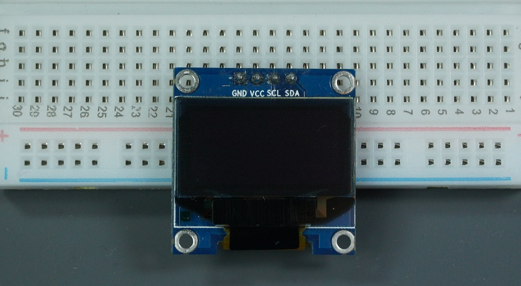

# OLED and joystick to make Atari-like game
This is a documentation for a question in Hardwars contest held by Sharif University of Technology.

## OLED
OLED monitors using I2C interface to communicate with the controller are provided (SSD 1306). An example picture of that is provided below:

image source: [Random nerd Tutorials](https://randomnerdtutorials.com/esp32-ssd1306-oled-display-arduino-ide/)

### Wiring
Display can be powered with both 3.3v or 5v. The SDA and SCL pins should be connected to the corresponding ones in the controller. In the ESP32, SDA is D21 and SCL is D22 and it's possible to reconfigure any other pin to act as one. To set custom I2C pins in ESP32 the following code is used:
```C++
Wire.begin(I2C_SDA, I2C_SCL);
```

### Libraries
To work with this module three main libraries need to be added to the Arduino's library manager. These libraries are "Adafruit SH110X", "Adafruit GFX Library" and "Adafruit BusIO". All of these libraries are provided by Adafruit.

### Address
The default address of this module is 0x3c which is changeable. To make sure of it's address the following I2C address scanner could be used:
```C++
/*********
  Rui Santos
  Complete project details at https://randomnerdtutorials.com  
*********/

#include <Wire.h>
 
void setup() {
  Wire.begin();
  Serial.begin(115200);
  Serial.println("\nI2C Scanner");
}
 
void loop() {
  byte error, address;
  int nDevices;
  Serial.println("Scanning...");
  nDevices = 0;
  for(address = 1; address < 127; address++ ) {
    Wire.beginTransmission(address);
    error = Wire.endTransmission();
    if (error == 0) {
      Serial.print("I2C device found at address 0x");
      if (address<16) {
        Serial.print("0");
      }
      Serial.println(address,HEX);
      nDevices++;
    }
    else if (error==4) {
      Serial.print("Unknow error at address 0x");
      if (address<16) {
        Serial.print("0");
      }
      Serial.println(address,HEX);
    }    
  }
  if (nDevices == 0) {
    Serial.println("No I2C devices found\n");
  }
  else {
    Serial.println("done\n");
  }
  delay(5000);          
}
```

### Example
An example is provided by "Adafruit SH110X" library called "SH1106_128x64_i2c_QTPY" which tests different functions of the library and the display's responses to them.

### Syntax
The "Adafruit_SH110X.h" library provides a set of functions to work with the SH1106G monocolor display. Some of the most important ones are listed below:

**Note**: This library first makes a buffer of the shape needed to be drawn then send it to the display using the __display()__ command.
#### **Basic Operations**
- **Creating a display instance:**  
  ```cpp
  Adafruit_SH1106G display = Adafruit_SH1106G(SCREEN_WIDTH, SCREEN_HEIGHT, &Wire, OLED_RESET);
  ```  
  For our module:  
  - `SCREEN_WIDTH = 128`  
  - `SCREEN_HEIGHT = 64`  
  - `OLED_RESET = -1` (no reset pin used)

- **Initializing the display:**  
  ```cpp
  display.begin(i2c_Address, true);
  ```  
  For our module, `i2c_Address = 0x3C`.

- **Clearing the display buffer:**  
  ```cpp
  display.clearDisplay();
  ```

- **Displaying the buffer content (refresh screen):**  
  ```cpp
  display.display();
  ```

#### **Text Rendering**
- **Set text size and color:**  
  ```cpp
  display.setTextSize(1);                 // Size can be 1, 2, 3, ...
  display.setTextColor(SH110X_WHITE);     // Only SH110X_WHITE is used for monocolor
  ```

- **Set cursor position:**  
  ```cpp
  display.setCursor(x, y);
  ```

- **Print text:**  
  ```cpp
  display.print("Hello");
  display.println("World");
  ```

- **Invert display colors:**  
  ```cpp
  display.invertDisplay(true);  // Set to false to disable inversion
  ```

#### **Advanced Drawing Commands**
- **Draw a single pixel:**  
  ```cpp
  display.drawPixel(x, y, SH110X_WHITE);
  ```

- **Draw a straight line:**  
  ```cpp
  display.drawLine(x0, y0, x1, y1, SH110X_WHITE);
  ```

- **Draw a rectangle (outline):**  
  ```cpp
  display.drawRect(x, y, width, height, SH110X_WHITE);
  ```

- **Draw a filled rectangle:**  
  ```cpp
  display.fillRect(x, y, width, height, SH110X_WHITE);
  ```

- **Draw a rounded rectangle:**  
  ```cpp
  display.drawRoundRect(x, y, width, height, radius, SH110X_WHITE);
  ```

- **Draw a filled rounded rectangle:**  
  ```cpp
  display.fillRoundRect(x, y, width, height, radius, SH110X_WHITE);
  ```

- **Draw a circle (outline):**  
  ```cpp
  display.drawCircle(x_center, y_center, radius, SH110X_WHITE);
  ```

- **Draw a filled circle:**  
  ```cpp
  display.fillCircle(x_center, y_center, radius, SH110X_WHITE);
  ```

- **Draw a triangle (outline):**  
  ```cpp
  display.drawTriangle(x0, y0, x1, y1, x2, y2, SH110X_WHITE);
  ```

- **Draw a filled triangle:**  
  ```cpp
  display.fillTriangle(x0, y0, x1, y1, x2, y2, SH110X_WHITE);
  ```

- **Draw a bitmap image:**  
  ```cpp
  display.drawBitmap(x, y, bitmapArray, width, height, SH110X_WHITE);
  ```  
  The `bitmapArray` should be a `const uint8_t` array containing bitmap data (1-bit per pixel).

#### Example:
```` cpp   
  display.begin(i2c_Address, true); 
  display.display();
  delay(2000);

  // Clear the buffer.
  display.clearDisplay();

  // draw a single pixel
  display.drawPixel(100, 10, SH110X_WHITE);
  // Show the display buffer on the hardware.
  // NOTE: You _must_ call display after making any drawing commands
  // to make them visible on the display hardware!
  display.display(); ````