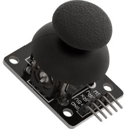

# گام دوم
## راه‌اندازی joystick
هر بازی به یک دسته بازی هم نیاز داره. در این گام شما قراره که این دسته بازی رو راه اندازی کنید. برای این کار از یک ماژول joystick به شکل زیر استفاده خواهد شد.


##  اتصال پایه‌ها

- **5V → 3v3+**
- **GND → GND**  

 پایه های **VRX** و **VRY** به هر پایه‌ای از ESP32 که دارای ADC باشد قابل متصل شدن هستند.  پایه **SW** باید به پایه‌ای از ESP32 متصل شود که قابلیت INPUT_PULLUP داشته باشد. برای انتخاب پایه‌های مناسب می‌توانید از مرجع مقابل کمک بگیرید: [Random Nerd Tutorials](https://randomnerdtutorials.com/esp32-pinout-reference-gpios/)
معمولا اکثر پایه‌‌هایی که در این مرجع به عنوان بدون مشکل معرفی شده‌اند قابلیت INPUT_PULLUP را دارند.

## نحوه کار Joystick
این قطعه بدین صورت کار می‌کند که یک مقاومت متغیر به عنوان محور  x و مقاومت متغیر دیگری را به عنوان محور y ارائه می‌دهد. با تغییر وضعیت joystick این مقاومت‌های متغیر، تغییر کرده و در نتیجه ولتاژ متغیری را در پایه‌های **VRX** و **VRY** به ما می‌دهند. ما با خواندن مقادیر این ولتاژها و کمی آزمون و خطا میتوانیم موقعیت محور joystick را پیدا کنیم. همچنین وقتی joystick را فشار میدید یک کلید وصل شده و پایه **SW** را به GND یعنی 0 ولت وصل می‌کند.

با استفاده از ADC می‌تونیم مقدار ولتاژ دقیق پایه‌های **VRX** و **VRY** رو اندازه بگیریم. همچنین موقع خوندن **SW** از قابلیت INPUTT_PULLUP استفاده می‌کنیم یعنی به ESP32 میگیم هر موقع که joystick فشار داده نشده مقدار 1 منطقی یا همون 5 ولت رو داریم و وقتی فشار داده شد مقدار 0 منطقی یا همون 0 ولت رو داریم. (آره با عقل جور درنمیاد ولی اینجوری برای جلوگیری از نویز بهتره)
##  راه‌اندازی اولیه

برای شروع استفاده باید بر اساس اتصالاتی که انتخاب کردید پایه‌هاتون رو تنظیم کنید:
```cpp
pinMode(VRX_PIN, INPUT);
pinMode(VRY_PIN, INPUT);
pinMode(SW_PIN, INPUT_PULLUP);
```

## خواندن مقادیر

```cpp
vrx=analogRead(VRX_PIN)
vry=analogRead(VRY_PIN)
sw=digitalRead(SW)

```

## وظیفه شما
در این گام شما باید مقادیر **VRX**و **VRY**   را خوانده بر روی صفحه نمایش نشان دهید. همچنین هر زمان که کلید فشرده شد با استفاده از دستور زیر رنگ‌ صفحه معکوس شده و هر موقع کلید رها شد وضعیت صفحه به حالت عادی برگردد
``` cpp
display.invertDisplay(true);  // Set to false to disable inversion
```
