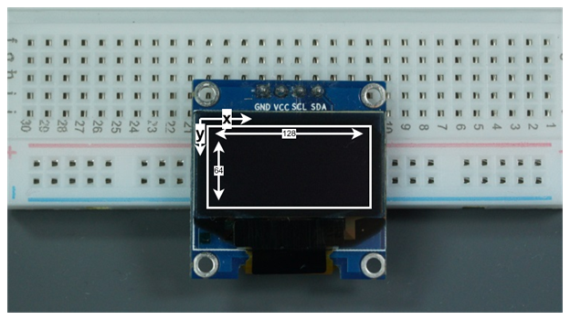

# گام دوم
## راه‌اندازی joystick
هر بازی به یک دسته بازی هم نیاز داره. در این گام شما قراره که این دسته بازی رو راه اندازی کنید. برای این کار از یک ماژول joystick به شکل زیر استفاده خواهد شد.
![]

##  اتصال پایه‌ها

- **تغذیه:** ۳.۳ یا ۵ ولت  
- **ارتباط I2C:**  
  - **SDA → D21**
  - **SCL → D22**  
  امکان تغییر پایه‌ها با کد زیر وجود دارد:
  ```cpp
  Wire.begin(I2C_SDA, I2C_SCL);
  ```

## کتابخانه‌های مورد نیاز

برای استفاده از OLED، باید این کتابخانه‌ها را از بخش Library Manager در Arduino IDE نصب کنید:
- `Adafruit SH110X`
- `Adafruit GFX Library`
- `Adafruit BusIO`

## آدرس I2C

آدرس پیش‌فرض نمایشگر: `0x3C`  
برای اطمینان از آدرس، می‌توانید از کد اسکنر I2C استفاده کنید. *(کد در ضمیمه قرار دارد)*

## نحوه کار صفحه نمایش
صفحه نمایش دارای 128 در 64 تا نقطه (یا همان پیکسل است) بردار مختصات صفحه نمایش به شکل زیر است:
کتابخانه ارائه شده بر اساس اشکالی که میخواهید رسم کنید برخی از این نقاط را روشن یا خاموش می‌کند و بدین صورت شما یک تصویر خواهید داشت.
##  راه‌اندازی اولیه

برای شروع استفاده:
```cpp
Adafruit_SH1106G display = Adafruit_SH1106G(128, 64, &Wire, -1);
display.begin(0x3C, true);
display.clearDisplay();
display.display();  // نمایش اطلاعات در نمایشگر
```

## نمایش متن

```cpp
display.setTextSize(1);               // اندازه متن
display.setTextColor(SH110X_WHITE);   // رنگ (فقط سفید)
display.setCursor(x, y);              // مکان شروع متن
display.println("Hello, world!");
```

## رسم اشکال

- **نقطه:**  `drawPixel(x, y, SH110X_WHITE)`
- **خط:** `drawLine(x0, y0, x1, y1, SH110X_WHITE)`
- **مستطیل:** `drawRect(x, y, width, height, SH110X_WHITE)` و `fillRect(x, y, width, height, SH110X_WHITE)`
- **دایره:** `drawCircle(x_center, y_center, radius, SH110X_WHITE)` و `fillCircle(x_center, y_center, radius, SH110X_WHITE)`
- **مثلث:** `drawTriangle(x0, y0, x1, y1, x2, y2, SH110X_WHITE)` و `fillTriangle(x0, y0, x1, y1, x2, y2, SH110X_WHITE)`
- **تصویر بیت‌مپ:** `drawBitmap(x, y, data, width, height, SH110X_WHITE)`

## __توجه__
 پس از هر بار تغییر باید از `display.display()` برای بروزرسانی صفحه استفاده شود.
---

## وظیفه شما
در این گام شما باید مثال پیشفرض خود کتابخانه‌ی SH110X را راه اندازی کنید. این مثال در خود آردوینو در بخش Examples تحت عنوان SH1106_128x64_i2c_QTPY قرار دارد. همچنین فایل این مثال در کنار همین راهنما هم قرار داده شده است.


##  ضمیمه‌ها

###  کد اسکنر آدرس I2C
```cpp
#include <Wire.h>

void setup() {
  Wire.begin();
  Serial.begin(115200);
  Serial.println("I2C Scanner");
}

void loop() {
  byte error, address;
  int nDevices = 0;

  Serial.println("Scanning...");
  for(address = 1; address < 127; address++) {
    Wire.beginTransmission(address);
    error = Wire.endTransmission();
    if (error == 0) {
      Serial.print("Device found at 0x");
      if (address < 16) Serial.print("0");
      Serial.println(address, HEX);
      nDevices++;
    }
  }
  if (nDevices == 0) Serial.println("No I2C devices found.");
  delay(5000);
}
```
###  مثال از کد صفحه نمایش
```` cpp   
  display.begin(i2c_Address, true); 
  display.display();
  delay(2000);

  // Clear the buffer.
  display.clearDisplay();

  // draw a single pixel
  display.drawPixel(100, 10, SH110X_WHITE);
  // Show the display buffer on the hardware.
  // NOTE: You _must_ call display after making any drawing commands
  // to make them visible on the display hardware!
  display.display(); ````