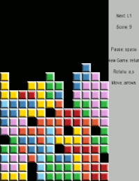
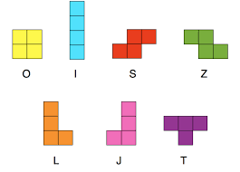

# گام سوم
## بازی تتریس
تتریس رو دیگه همه میشناسن :)



##  مرحله ۱: طراحی صفحه Tetris و زمین بازی
هدف: ایجاد یک صفحه بازی 10×20 بلاک که در آن بلوک‌ها فرود می‌آیند.

نکات:

* هر بلوک یک مربع 6x6 پیکسلی باشد   .
    * منظور از بل.ک ک.چیک‌ترین عضو سازنده‌ی قطعه در تتریس است. 

* کل بازی را در حافظه به صورت یک آرایه 2 بعدی (int board[20][10]) نگه دار.
    * اگر خانه‌ای در این آرایه 0 باشد یعنی بلوک متناظر آن خالی بوده و در صفحه نمایش نیز روشن نیست.
* در این مرحله ابتدا شبکه قرار گیری بلوک ها را تعریق کنید سپس یک خط با 1 بلاک عرض و 3 بلاک طول در میانه این شبکه قرار دهید.

## مرحله ۲: تعریف قطعه‌ها (Tetrominoes)

هدف: تعریف شکل‌های مختلف قطعه‌ها (I, O, T, L, J, S, Z)
نکات:

* هر قطعه را به صورت یک ماتریس 4×4 بلاک ذخیره کن.

* می‌تونی از آرایه‌های چندبعدی برای تعریف هر یک از اشکال استفاده کنی.
مثال:
````CPP
const byte T[4][4] = {
  {0,1,0,0},
  {1,1,1,0},
  {0,0,0,0},
  {0,0,0,0}
};

````
* در این مرحله باید 7 قطعه استاندارد تتریس را تعریف کنید. این قطعات به شکل زیر هستند:


* درنهایت برای اطمینان از درستی پیاده سازی قطعه L را در موقعیت 5 و 5 از شبکه خود نمایش دهید.

## مرحله ۳: حرکت و افتادن بلاک
هدف: پیاده‌سازی منطق افتادن تدریجی بلاک از بالا به پایین.

نکات:

* بلاک با هر فریم یک سلول به پایین برود.

* بازیکن بتواند با جوی‌استیک یا دکمه، بلاک را به چپ یا راست حرکت دهد.
* بلاک در پایین شبکه یا روی دیگر بلوک‌ها متوقف شود.

## مرحله ۴: ذخیره بلاک در جدول
هدف: وقتی بلاک دیگر نتواند حرکت کند، به board[][] اضافه شود.
نکات:

* بعد از برخورد، مقدار سلول‌های اشغال‌شده را در board قرار بده.

* پس از پایان کار بلاک قبلی، بلاک جدیدی از بالا وارد شود.

## مرحله ۵: حذف ردیف کامل

هدف: اگر یک ردیف کامل شد، آن را حذف کن و ردیف‌های بالایی را یک پله پایین بیار.
نکات:

* بررسی هر ردیف برای پر بودن کامل.

* اگر ردیفی پر بود، آن ردیف را پاک کن و ردیف‌های بالایی را پایین بیاور.
* برای این کار مدام با قرارگیری هر بلوک جدید آرایه board را چک کنید.

## مرحله ۷: پایان بازی (Game Over)

هدف: اگر بلاکی نتواند در داخل صفحه بازی قرار گیرد  بازی پایان میابد. به عبارتی دیگر اگر زمانی که قطعه جدیدی را به بازی معرفی کردید از همان  ابتدا بلوکی از آن با حداقل یکی از بلوک‌های board تداخل داشت بازی تمام می‌شود.

نکات:

* بررسی برخورد بلاک جدید با خانه‌های اشغال‌شده در بالای صفحه بازی.

* نمایش پیام پایان بازی.

##  بهبود اختیاری
* چرخش قطعات را به بازی اضافه کنید
* با اعمال حهت پایین، بلوک فعلی به سرعت پایین برود و نیازی به انتظار برای سقوط کامل آن نباشد