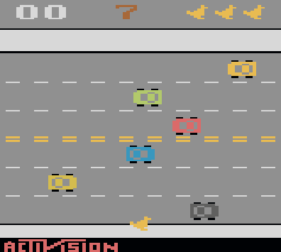

# گام سوم
## بازی عبور مرغ (chicken cross)
اگر تونستی از این خیابون رد شو :)
بازیکن باید مرغ را از پایین صفحه به بالا برساند بدون اینکه با موانع برخورد کند. هر بار که موفق شود، یک امتیاز می‌گیرد.

## مرحله ۱:  طراحی مرغ
مرغ می‌تواند یک مربع کوچک 6 در 6 باشد  که از پایین صفحه شروع کرده و در چهار جهت اصلی می‌تواند حرکت کند.

نکات:

* موقعیت مرغ را با دو متغیر ذخیره کن.
* با جوی‌استیک، موقعیت را تغییر بده.
* در هر فریم، مرغ را در موقعیت جدید دوباره رسم کن.

## مرحله ۲: طراحی موانع
موانع ( ماشین ها) در ردیف‌های خاصی از صفحه به‌صورت افقی حرکت می‌کنند. اگر مرغ به یکی از آن‌ها برخورد کند، بازی تمام می‌شود.
* حداقل 5 ردیف مانع در نظر بگیرید یعنی خیابان شما حداقل 5 لاین داشته باشد.
* جهت، سرعت حرکت و اندازه هر مانع متفاوت باشد..
* هر بار که مانع از صفحه خارج شد، از سمت دیگر دوباره وارد شود.

## مرحله ۴: تشخیص برخورد و باخت

* از ساده‌ترین روش برخورد مستطیل با مستطیل استفاده شود (AABB collision).

* اگر برخورد اتفاق افتاد، بازی تمام شود.
* در صورت برخورد، پیام «Game Over» نمایش دهید در این حالت اگر joystick فشار داده شود بازی از اول شروع بشود.

## مرحله ۵: امتیاز دهی و نمایش آن
به ازای هر مرغی که از تمامی خطوط خیابان عبورکرده و به بالای صفحه برسد یک امتیاز به کاربر اضافه شود. این امتیاز را در گوشه ای از تصویر نشان دهید.

با هر بار Game Over شدن این امتیاز دوباره صفر می‌شود.

##  بهبودهای اختیاری
* اضافه کردن انیمیشن به حرکت مرغ
* طراحی دقیق‌تر و با جزئیات تر ماشین‌ها و مرغ
* اضافه کردن مراحل جدیدتر و چالش برانگیزتر