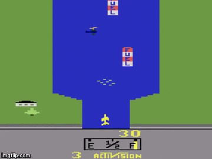

# گام سوم
## بازی هواپیما آتاری
حال وقت آن است که یادی از خاطره‌ها کرده و بازی هواپیمای آتاری را بسازیم.


##  مرحله ۱: طراحی هواپیمای خودی

هدف: رسم یک شکل ساده‌ی نمایشی برای هواپیمای بازیکن
نکات:

* یک هواپیما می‌تواند با یک bitmap ساده یا مجموعه‌ای از خطوط و مستطیل‌ها ساخته شود.

* پیشنهاد می‌شود از تابع drawBitmap() یا ترکیب drawLine() و fillTriangle() استفاده شود.

مثال ساده (مثلث وارونه):
````cpp
display.fillTriangle(x, y, x - 5, y + 10, x + 5, y + 10, SH110X_WHITE);
````

* یک تابع بنویس که هواپیما را در موقعیت مشخصی از صفحه رسم کند.

* مختصات اولیه‌ی هواپیما را پایین صفحه وسط قرار دهد.
##  مرحله ۲: کنترل حرکت با جوی‌استیک
هدف: حرکت هواپیما با جوی‌استیک در راستای افقی

در این مرجله باید با خواندن مقدار یکی از محورهای جوی استیک میزان تغییر جایگاه افقی هواپیما را مشخص کنید. برای این کار بازه مقادیر محور را به ۳ دسته حرکت به چپ و ۳ دسته حرکت به راست و یک دسته ساکن تقسیم کنید. بدین صورت که در هر دسته بر سرعت حرکت به سمت چپ یا راست افزوده می‌شود.

حال طبق مقدار به دست آمده برای موقعیت جدید هواپیما تصویر را آپدیت کنید.

**توجه**: فراموش نکنید که در ابتدای هر فریم از بازی خود صفحه را پاک کنید.

##  مرحله ۳: اضافه کردن دشمن‌ها
هدف: رسم دشمن‌هایی که از بالای صفحه به پایین حرکت می‌کنند.
* دشمن‌ها می‌توانند دایره یا مربع باشند.
* در هر فریم مکان آن‌ها کمی به پایین بیاید
* موقعیت آغازین هر دشمن به صورت تصادفی انتخاب شود
* هر موقع یک دشمن به پایین رسید با فاصله زمانی کوتاهی دشمن بعدی ظاهر شود

##  مرحله ۴: اضافه کردن شلیک
هدف: با فشردن joystick هواپیما یک گلوله شلیک می‌کند که در صورت برخورد با دشمن به امتیاز بازی‌کن افزوده و دشمن از بین می‌رود.
* ضخامت گلوله بیستر از ۵ پیکسل نباشد
* گلوله از نوک هواپیما شروع کرده و به سمت بالا می‌رود

## مرحله ۵: برخورد (Collision Detection)
هدف: بررسی برخورد بین نوک هواپیما و دشمن‌ها
نکات:
* موقعیت نوک هواپیما را با موقعیت دایره دشمن مقایسه کن.
* اگر فاصله‌ای کمتر از حد خاصی بود، برخورد رخ داده است.
* گر برخورد اتفاق افتاد، پیام "Game Over" را نشان دهد.
* پس از برخورد، بازی متوقف شود یا از ابتدا شروع شود.
* همچنین اگر مرکز گلوله و دشمن از حدی به هم نزدیک تر شد هم دشمن و هم گلوله از بین رفته و به امتیاز بازیکن افزوده شود.

##  مرحله ۶: نمایش امتیاز کاربر

درگوشه‌ای از تصویر مقدار امتیاز فعلی کاربر نمایش داده شود.

##  بهبود اختیاری
ویژگی محدودیت سوخت را به بازی اضافه کنید. برای دریافت دوباره سوخت باید هواپیما روی مستطیل هایی (بشکه سوخت) برود که همانند دشمن‌ها تولید شده و حرکت می‌کنند. در صورت برخورد گلوله با این بشکه‌های سوخت آن بشکه از دست خواهد رفت.
